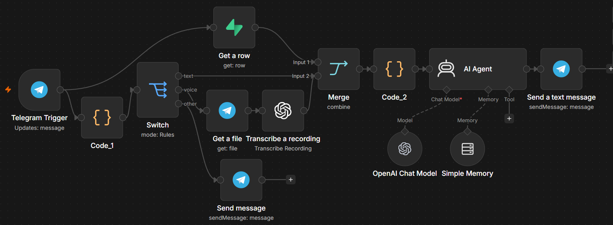
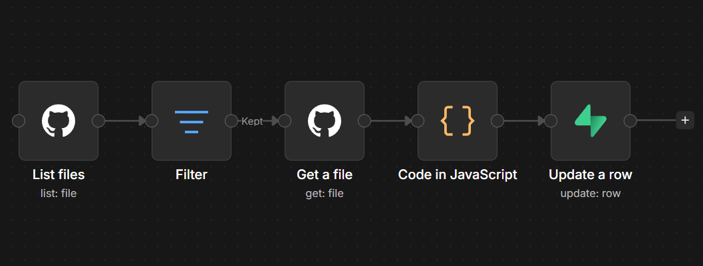

# AI-Powered Technical Documentation Agent (CAG Architecture) 

An advanced AI orchestration system built with **n8n** that transforms a static GitHub repository into an interactive, voice-enabled technical expert.

  

## Project Overview
This project implements a **CAG (Cache-Augmented Generation)** pipeline. Unlike traditional RAG, which can lose context during chunking, this system aggregates the entire codebase into a high-speed knowledge store, ensuring the AI Agent has a holistic understanding of the project.

The agent is accessible via **Telegram** and supports both **text and voice** queries.

## System Architecture

### 1. Multimodal Input Layer
- **Text Path:** Direct processing of Telegram messages.
- **Voice Path:** Integrated **OpenAI Whisper** for seamless speech-to-text transcription.
- **Normalization:** A custom JavaScript layer ensures all inputs are converted into a standardized `user_query` format.

### 2. Knowledge Layer (CAG)
- **Data Source:** Automated collection of `.py` and `.md` files from GitHub.
- **High-Speed Cache:** Integrated **Supabase (PostgreSQL)** to store the aggregated codebase.
- **Latency Optimization:** By moving from direct GitHub API calls to a Supabase cache, I reduced response latency from **~10s to ~2s**.

### 3. Reasoning Engine
- **LLM:** Powered by **OpenAI GPT-4o-mini**.
- **Context Injection:** The full project codebase is injected into the system prompt, guaranteeing 100% accuracy in code referencing.
- **State Management:** `Simple Memory` integration to maintain conversation history per user (`Chat ID`).

---

## 🛠 Tech Stack

| Layer | Technology | Purpose |
| :--- | :--- | :--- |
| **Orchestration** | `n8n` | Workflow automation & AI Logic |
| **Database** | `Supabase` | Knowledge caching & state management |
| **LLM** | `OpenAI GPT-4o-mini` | Technical reasoning |
| **STT** | `OpenAI Whisper` | Voice-to-text transcription |
| **Interface** | `Telegram Bot API` | User interaction |

---

## Engineering Decisions

- **Why CAG over RAG?** For small-to-medium repositories, CAG eliminates "retrieval noise" and ensures the model sees the entire architecture, which is critical for understanding complex class inheritances in PyTorch.
- **Data Normalization:** Implemented a pre-processing layer to handle diverse input types (voice/text), ensuring the AI Agent receives a clean, consistent prompt.

## Setup & Installation

I have automated the deployment process. You don't need to manually copy-paste the codebase into the database.

### 1. Knowledge Base Synchronization
First, you need to populate your Supabase database with the project's source code:
- Import the `setup_knowledge.json` into your n8n instance.

  

  
- Configure your **GitHub** and **Supabase** credentials.
- Click **Execute Workflow**. This will automatically fetch the latest files from my repository and populate the `project_knowledge` table in your Supabase.

### 2. Launching the AI Agent
Once the knowledge base is synced:
- Import the `vit_export_bot_workflow.json` into your n8n instance.
- Configure your **Telegram, OpenAI, and Supabase** credentials.
- Set the workflow to **Active**.

**Try the AI Agent:** [Chat with my ViT Expert Bot](https://t.me/q_urd_bot)

 **Target Codebase:** This bot analyzes my [Vision Transformer Implementation](https://github.com/Alihcyv/freeCodeCamp-AI-Journey/blob/main/vit_implementation/README.md).
