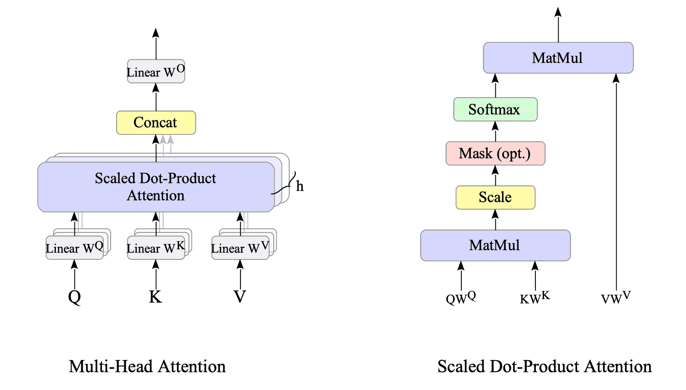
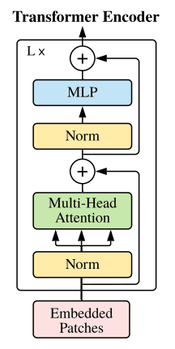
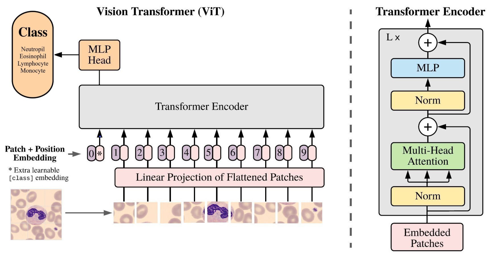

# Vision Transformer (ViT) from Scratch

This project is a complete implementation of the Vision Transformer (ViT) architecture. The main idea of ViT is to treat an image as a sequence of patches, allowing us to apply the Transformer architecture (originally designed for Natural Language Processing) to Computer Vision tasks.

## Architecture Breakdown

### 1. Patch Embedding
Transformers were originally designed for NLP, where words are converted into vector embeddings. To apply this to images, we need to convert a 2D image into a 1D sequence of vectors.

```python
class PatchEmbedding(nn.Module):
    def __init__(self, patch_size, image_size, channels, embed_dim) -> None:
        super().__init__()
        self.patch_size = patch_size
        self.proj = nn.Conv2d(
            in_channels=channels,
            out_channels=embed_dim,
            kernel_size=patch_size,
            stride=patch_size
        )
        
        num_patches = (image_size // patch_size) ** 2
        self.cls_token = nn.Parameter(torch.randn(1, 1, embed_dim))
        self.pos_embed = nn.Parameter(torch.randn(1, 1 + num_patches, embed_dim))

    def forward(self, x: torch.Tensor):
        B = x.size(0)
        x = self.proj(x) 
        x = x.flatten(2).transpose(1, 2) 
        cls_token = self.cls_token.expand(B, -1, -1)
        x = torch.cat((cls_token, x), dim=1) 
        x = x + self.pos_embed
        return x
```

1. **`self.proj` (Convolutional Projection):**
    - We create filters of size `patch_size` $\times$ `patch_size` for the input `channels`.
    - The number of filters equals `out_channels` (`embed_dim`).
    - By setting `stride=patch_size`, we ensure that the patches do not overlap, effectively slicing the image.
    - **Output Shape:** `[B, embed_dim, image_size/patch_size, image_size/patch_size]`

2. **`flatten(2).transpose(1, 2)` (Reshaping):**
    - `flatten(2)` merges the spatial dimensions (height and width of the patch grid) into one.
    - `transpose(1, 2)` swaps the dimensions to move the embedding vector to the end.
    - **Output Shape:** `[B, num_patches, embed_dim]`

3. **`self.cls_token.expand(B, -1, -1)` (Batch Alignment):**
    - The `cls_token` is initialized as `[1, 1, embed_dim]`. To match the batch size `B`, we use `.expand()`.
    - The value `-1` tells PyTorch to keep the dimension as it is.
    - **Output Shape:** `[B, 1, embed_dim]`

4. **`torch.cat((cls_token, x), dim=1)` (The Aggregator):**
    - We concatenate the `cls_token` to the start of the patch sequence.
    - This additional patch acts as a "global representative" that collects information from all other patches through the attention mechanism.
    - At the end of the model, only this token's output is used for the loss function and classification.
    - **Output Shape:** `[B, 1 + num_patches, embed_dim]`

5. **`x + self.pos_embed` (Positional Embedding):**
    - We add positional weights because spatial information is critical for the model to understand the structure of an image.
    - These embeddings also help the model differentiate the global classification token from the actual image patches.
    - **Observation:** Based on my experiments, disabling the positional embeddings led to significantly lower performance, which was especially noticeable when training on more complex images.
    - **Output Shape:** `[B, 1 + num_patches, embed_dim]`


### 2. MLP (Multi-Layer Perceptron / Feed-Forward Network)
In Transformer architectures, this block is often referred to as the **FFN (Feed-Forward Network)**. While the Attention mechanism allows tokens to interact with each other, the MLP allows each token to process its own features independently.

```python
class MLP(nn.Module):
    def __init__(self, in_features, hid_features, drop_rate) -> None:
        super().__init__()
        self.fc1 = nn.Linear(in_features, hid_features)
        self.fc2 = nn.Linear(hid_features, in_features)
        self.drop = nn.Dropout(drop_rate)

    def forward(self, x):
        x = self.fc1(x)
        x = F.gelu(x)
        x = self.drop(x)
        x = self.fc2(x)
        x = self.drop(x)
        return x
```

- **Purpose:** It acts as a local feature processor, mapping the attention-weighted representations into a higher-dimensional space to extract more complex patterns and then projecting them back.
- **GELU Activation:** Instead of the standard ReLU, I used the **GELU (Gaussian Error Linear Unit)** activation function. 
    - **Why GELU?** Unlike ReLU, which abruptly zeros out all negative values (creating "dead neurons"), GELU provides a smooth, stochastic transition. It allows a small amount of negative information to pass through, which helps the model learn more complex functions and generally leads to better convergence in Transformers.

<p align="center">
  
</p>

- **Regularization:** I implemented **Dropout** after both linear transformations to prevent the model from overfitting on the training data.


### 3. Multi-Head Self-Attention (MSA)
The Attention mechanism is the core of the Transformer. It allows the model to dynamically focus on different parts of the image to understand global dependencies.

```python
class MultiHeadAttention(nn.Module):
    def __init__(self, embed_dim, num_heads, drop_rate): 
        super().__init__()
        self.num_heads = num_heads
        self.head_dim = embed_dim // num_heads
        self.qkv = nn.Linear(embed_dim, embed_dim * 3, bias=False)
        self.proj = nn.Linear(embed_dim, embed_dim)
        self.attn_drop = nn.Dropout(drop_rate)
        self.proj_drop = nn.Dropout(drop_rate)

    def forward(self, x):
        B, T, C = x.shape
        qkv = self.qkv(x).reshape(B, T, 3, self.num_heads, self.head_dim).permute(2, 0, 3, 1, 4)
        q, k, v = qkv[0], qkv[1], qkv[2]

        att = (q @ k.transpose(-2, -1)) * (self.head_dim ** -0.5)
        att = F.softmax(att, dim=-1)
        att = self.attn_drop(att)
        
        out = att @ v
        out = out.transpose(1, 2).reshape(B, T, C)
        out = self.proj(out)
        out = self.proj_drop(out)
        return out
```

#### The QKV Paradigm (Query, Key, Value)
Instead of processing the embedding as a single vector, I project it into three different roles using a single combined linear layer `self.qkv = nn.Linear(embed_dim, embed_dim * 3)` for computational efficiency:

- **Query (Q):** The "request". It asks: *"Which other patches are relevant to me?"*
- **Key (K):** The "description". It answers: *"This is what I contain; here is my relevance."*
- **Value (V):** The "content". It says: *"If I am relevant, here is the information I provide."*

<p align="center">
  
</p>

#### Why "Multi-Head"?
I split the `embed_dim` into multiple heads (`head_dim = embed_dim // num_heads`). 
**Logic:** A single attention head can only focus on one type of relationship. By using multiple heads, the model can simultaneously attend to different patterns (e.g., one head focuses on edges, another on textures, another on the relationship between distant objects).

#### Tensor Manipulation
To process multiple heads in parallel, I perform a series of tensor transformations:
1. **Projection:** `(B, T, C)` $\rightarrow$ `(B, T, 3*C)`
2. **Reshape:** I split the long vector into 3 parts (Q, K, V) and further divide them into heads $\rightarrow$ `(B, T, 3, num_heads, head_dim)`.
3. **Permute:** I rearrange the dimensions to `(3, B, num_heads, T, head_dim)` so that we can easily extract $Q$, $K$, and $V$ as separate tensors and perform matrix multiplication across all heads simultaneously.

#### Scaled Dot-Product Attention

$$\text{Attention}(Q, K, V) = \text{softmax}\left(\frac{QK^T}{\sqrt{d_k}}\right)V$$

The interaction between patches is calculated as follows:
1. **Attention Map:** We multiply $Q$ and $K^T$ to get a score matrix. This represents the "interaction strength" between every pair of patches.
2. **Scaling:** We multiply by $1/\sqrt{head\_dim}$. This prevents the dot product from growing too large, which would push the Softmax into regions with tiny gradients (preventing gradient explosion/vanishing).
3. **Softmax:** We apply Softmax across the last dimension. This turns the scores into probabilities (summing to 100%), effectively distributing the "attention budget" across all patches.
4. **Aggregation:** We multiply these weights by $V$. The resulting vector for each patch is no longer just its own information, but a weighted sum of information from all other relevant patches.

#### The Role of Dropout (`drop_rate`)
At first glance, it might seem counterintuitive to randomly "drop" information within the Attention mechanism. However, this is a critical regularization technique to prevent the model from becoming "lazy."

**Why is this necessary?**
- **Preventing Co-adaptation:** Without Dropout, the model often relies on a few highly dominant features (the "brightest" patterns) to make predictions. This leads to **co-adaptation**, where neurons depend too heavily on each other, creating a rigid network that fails to generalize.
- **Forcing Robustness:** By randomly zeroing out elements of the attention map, we force the model to distribute its attention across multiple features. If the most dominant signal is dropped, the model *must* learn to use secondary and tertiary patterns to achieve the correct result.

#### Final Projection (`self.proj`)
After the attention process, the outputs from all heads are concatenated back into a single vector. I pass this through a final linear layer `self.proj`. 
**Purpose:** This layer fuses the diverse information learned by different heads and provides the model with additional learnable parameters to refine the final representation.

### 4. Transformer Encoder Layer: The Building Block
The `TransformerEncoderLayer` is the fundamental unit of the ViT. It combines attention and feed-forward networks into a cohesive structure designed for stability and deep feature extraction.

```python
class TransformerEncoderLayer(nn.Module):
    def __init__(self, embed_dim, mlp_dim, num_heads, drop_rate) -> None:
        super().__init__()
        self.norm1 = nn.LayerNorm(embed_dim)
        self.attention = MultiHeadAttention(embed_dim, num_heads, drop_rate)
        self.norm2 = nn.LayerNorm(embed_dim)
        self.mlp = MLP(embed_dim, mlp_dim, drop_rate)

    def forward(self, x):
        x = x + self.attention(self.norm1(x)) 
        x = x + self.mlp(self.norm2(x))
        return x
```

#### Residual Connections (Skip-Connections)
The implementation uses the formula $x = x + \text{Layer}(x)$, known as a **Residual Connection**. 
- **The Problem:** In very deep networks, gradients tend to vanish or explode as they propagate backward through many layers, making it nearly impossible for the early layers to learn.
- **The Solution:** Residual connections create a "highway" for the gradient to flow directly through the network without being diminished. This allows the model to learn the *difference* (the residual) between the input and output, ensuring that the identity mapping is preserved and the signal remains strong regardless of the network depth.

<p align="center">
  
</p>

#### Layer Normalization & The Pre-Norm Architecture
To ensure numerical stability and faster convergence, I implemented **Layer Normalization** (`nn.LayerNorm`). 

Unlike the original Transformer (Post-Norm), where normalization happened *after* the residual addition, **Pre-Norm** applies normalization *before* the Attention and MLP blocks. 
- **Stability:** Pre-Norm prevents the gradients from becoming too large during the initial stages of training.
- **Convergence:** It makes the optimization landscape smoother, allowing for higher learning rates and more stable training from scratch, which is the current standard for Vision Transformers (ViT).

### 5. VisionTransformer: The Global Orchestrator
The `VisionTransformer` class is the top-level module that defines the end-to-end flow of data. It coordinates the transformation of a raw image into a final class prediction.

```python
class VisionTransformer(nn.Module):
    def __init__(self, patch_size, image_size, channels, num_classes, embed_dim, depth, num_heads, mlp_dim, drop_rate) -> None:
        super().__init__()
        self.patch_embed = PatchEmbedding(patch_size, image_size, channels, embed_dim)
        self.encoder = nn.Sequential(*[
            TransformerEncoderLayer(embed_dim, mlp_dim, num_heads, drop_rate)
            for _ in range(depth)
        ])
        self.norm = nn.LayerNorm(embed_dim)
        self.head = nn.Linear(embed_dim, num_classes)

    def forward(self, x):
        x = self.patch_embed(x)
        x = self.encoder(x)
        x = self.norm(x)
        x = x[:, 0]
        x = self.head(x)
        return x
```

The forward pass follows a strict sequence:
- **Image $\rightarrow$ Sequence:** The `PatchEmbedding` layer converts the image into a sequence of vectors and adds the `[CLS]` token.
- **Deep Feature Extraction:** The sequence passes through the `encoder`, which consists of multiple `TransformerEncoderLayer` blocks. In each block, the patches "communicate" via Self-Attention, refining their representations.
- **Final Stabilization:** A final `LayerNorm` is applied to ensure the embeddings are well-scaled before reaching the classification head.

The most critical operation in the forward pass is `x = x[:, 0]`. 
- At the start, the `[CLS]` token is just a random learnable vector.
- However, as it passes through the Transformer Encoder, the **Self-Attention mechanism** allows the `[CLS]` token to attend to every single patch in the image.
- By the time the data reaches the final layer, the `[CLS]` token has effectively "summarized" the most important information from the entire image.
- Therefore, we can discard the individual patch tokens and use the `[CLS]` token as a **global representation (embedding)** of the image.
- Finally, the summary vector is passed through a linear layer (`self.head`), which maps the high-dimensional embedding to the number of target classes.

<p align="center">
  
</p>

## Author

This project was inspired by and based on the educational materials provided by **freeCodeCamp**. 

The core implementation logic and architectural insights were gained from their comprehensive AI/Machine Learning courses on YouTube. I am grateful for their high-quality resources that make complex AI concepts accessible to everyone.

- first [freeCodeCamp YouTube Channel](https://www.youtube.com/watch?v=7o1jpvapaT0&t)
- second [freeCodeCamp YouTube Channel](https://www.youtube.com/watch?v=4XgDdxpXHEQ&t)
